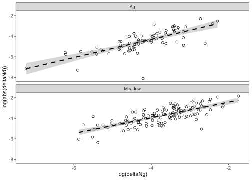

Growth vs death change in abundance figure
================
Cassandra Wattenburger
07/24/2024

``` r
# Clear working directory, load in packages, generate package info
rm(list=ls())

library("tidyverse")

sessionInfo()
```

    ## R version 4.3.1 (2023-06-16)
    ## Platform: x86_64-pc-linux-gnu (64-bit)
    ## Running under: Ubuntu 18.04.4 LTS
    ## 
    ## Matrix products: default
    ## BLAS:   /opt/R/4.3.1/lib/R/lib/libRblas.so 
    ## LAPACK: /opt/R/4.3.1/lib/R/lib/libRlapack.so;  LAPACK version 3.11.0
    ## 
    ## locale:
    ##  [1] LC_CTYPE=en_US.UTF-8       LC_NUMERIC=C              
    ##  [3] LC_TIME=en_US.UTF-8        LC_COLLATE=en_US.UTF-8    
    ##  [5] LC_MONETARY=en_US.UTF-8    LC_MESSAGES=en_US.UTF-8   
    ##  [7] LC_PAPER=en_US.UTF-8       LC_NAME=C                 
    ##  [9] LC_ADDRESS=C               LC_TELEPHONE=C            
    ## [11] LC_MEASUREMENT=en_US.UTF-8 LC_IDENTIFICATION=C       
    ## 
    ## time zone: America/New_York
    ## tzcode source: system (glibc)
    ## 
    ## attached base packages:
    ## [1] stats     graphics  grDevices utils     datasets  methods   base     
    ## 
    ## other attached packages:
    ##  [1] lubridate_1.9.3 forcats_1.0.0   stringr_1.5.1   dplyr_1.1.4    
    ##  [5] purrr_1.0.2     readr_2.1.5     tidyr_1.3.1     tibble_3.2.1   
    ##  [9] ggplot2_3.5.1   tidyverse_2.0.0
    ## 
    ## loaded via a namespace (and not attached):
    ##  [1] gtable_0.3.5      compiler_4.3.1    tidyselect_1.2.1  scales_1.3.0     
    ##  [5] yaml_2.3.9        fastmap_1.2.0     R6_2.5.1          generics_0.1.3   
    ##  [9] knitr_1.48        munsell_0.5.1     pillar_1.9.0      tzdb_0.4.0       
    ## [13] rlang_1.1.4       utf8_1.2.4        stringi_1.8.4     xfun_0.46        
    ## [17] timechange_0.3.0  cli_3.6.3         withr_3.0.0       magrittr_2.0.3   
    ## [21] digest_0.6.36     grid_4.3.1        rstudioapi_0.16.0 hms_1.1.3        
    ## [25] lifecycle_1.0.4   vctrs_0.6.5       evaluate_0.24.0   glue_1.7.0       
    ## [29] fansi_1.0.6       colorspace_2.1-0  rmarkdown_2.27    tools_4.3.1      
    ## [33] pkgconfig_2.0.3   htmltools_0.5.8.1

# Import and prep data

``` r
growth <- readRDS("../data_intermediate/NIFA_grests_final_ind.rds")
pap <- readRDS("../data_intermediate/NIFA_paprica_ests.rds")

growth_pap <- inner_join(growth, pap) %>% 
  mutate(Replicate = as.character(Replicate))

growth_asv <- growth_pap %>% # average replicates
  group_by(Soil, ASV) %>% 
  summarize_if(is.numeric, mean) %>% 
  ungroup()

death <- readRDS("../data_intermediate/NIFA_dests_final_ind.rds")
head(death)
```

    ##                                  label Soil Replicate
    ## 1 Ag1_06429c3bcf33bbe215406bb713d496ec   Ag         1
    ## 2 Ag1_100ad92464ad534d76ec29dd51a2cec4   Ag         1
    ## 3 Ag1_1b486d499bd566354698051626670a55   Ag         1
    ## 4 Ag1_1d18d7d6425207e0c08c5ef65b930b2e   Ag         1
    ## 5 Ag1_25ad1976b835997537e3960fb9deefbf   Ag         1
    ## 6 Ag1_262f4ba424fbd0f94d5a7278721aacc4   Ag         1
    ##                                ASV       slope      yint          k         h
    ## 1 06429c3bcf33bbe215406bb713d496ec -0.28793193 -1.232194 0.20757578  3.339249
    ## 2 100ad92464ad534d76ec29dd51a2cec4 -0.10865717 -2.005173 0.09406542  7.368778
    ## 3 1b486d499bd566354698051626670a55 -0.08552474 -2.392597 0.07614343  9.103177
    ## 4 1d18d7d6425207e0c08c5ef65b930b2e -0.11575082 -3.402008 0.09937367  6.975159
    ## 5 25ad1976b835997537e3960fb9deefbf -0.04192266 -3.673251 0.03949560 17.549985
    ## 6 262f4ba424fbd0f94d5a7278721aacc4 -0.20253867 -4.647428 0.15827929  4.379266
    ##   start_pt end_pt start_day end_day start_abund   end_abund change_abund
    ## 1        7     13       3.0     6.5 0.142857143 0.042203986 -0.100653157
    ## 2       17     25       9.0    25.0 0.056375839 0.010060362 -0.046315477
    ## 3       16     22      15.0    27.0 0.031963470 0.008639309 -0.023324161
    ## 4       11     19       5.0    14.0 0.022339028 0.006858711 -0.015480317
    ## 5        4     16       1.5    25.0 0.018166804 0.008048290 -0.010118515
    ## 6        1      8       0.0     8.0 0.006444683 0.001312336 -0.005132347

``` r
# Average across reps
death_asv <- death %>% 
  mutate(Replicate = as.character(Replicate)) %>% 
  group_by(Soil, ASV) %>% 
  summarize_if(is.numeric, mean) %>% 
  ungroup()

# Combine growth and death
deltaN <- death_asv %>% 
  select(Soil, ASV, change_death = change_abund) %>% 
  inner_join(growth_asv) %>% 
  mutate(deltaNd = change_death/n16S,
         deltaNg = change_abund/n16S) %>% 
  select(Soil, ASV, deltaNg, deltaNd)
```

# Visualize

``` r
deltaN_graph <- deltaN %>% 
  ggplot(aes(x=log(deltaNg), y=log(abs(deltaNd)))) +
  geom_point(size=2, shape=1) +
  geom_smooth(method="lm", color="black", linetype=2) +
  facet_wrap(~Soil, nrow=2) +
  theme_test() +
  theme(axis.text=element_text(size=10))
deltaN_graph
```

    ## Warning in log(deltaNg): NaNs produced
    ## Warning in log(deltaNg): NaNs produced

    ## Warning: Removed 1 row containing non-finite outside the scale range
    ## (`stat_smooth()`).

    ## Warning: Removed 1 row containing missing values or values outside the scale range
    ## (`geom_point()`).

<!-- -->

``` r
ggsave(deltaN_graph, file="../figures/fig_deltaNgd.svg", units="mm", width=85, device="svg")
```

    ## Warning in log(deltaNg): NaNs produced

    ## Warning in log(deltaNg): NaNs produced

    ## Warning: Removed 1 row containing non-finite outside the scale range
    ## (`stat_smooth()`).

    ## Warning: Removed 1 row containing missing values or values outside the scale range
    ## (`geom_point()`).

``` r
# Stats
cor.test(log(deltaN[deltaN$Soil=="Ag",]$deltaNg), log(abs(deltaN[deltaN$Soil=="Ag",]$deltaNd)), method="pearson")
```

    ## 
    ##  Pearson's product-moment correlation
    ## 
    ## data:  log(deltaN[deltaN$Soil == "Ag", ]$deltaNg) and log(abs(deltaN[deltaN$Soil == "Ag", ]$deltaNd))
    ## t = 9.9706, df = 78, p-value = 1.437e-15
    ## alternative hypothesis: true correlation is not equal to 0
    ## 95 percent confidence interval:
    ##  0.6329492 0.8315189
    ## sample estimates:
    ##       cor 
    ## 0.7485636

``` r
cor.test(log(deltaN[deltaN$Soil=="Meadow",]$deltaNg), log(abs(deltaN[deltaN$Soil=="Meadow",]$deltaNd)), method="pearson")
```

    ## Warning in log(deltaN[deltaN$Soil == "Meadow", ]$deltaNg): NaNs produced

    ## 
    ##  Pearson's product-moment correlation
    ## 
    ## data:  log(deltaN[deltaN$Soil == "Meadow", ]$deltaNg) and log(abs(deltaN[deltaN$Soil == "Meadow", ]$deltaNd))
    ## t = 12.862, df = 128, p-value < 2.2e-16
    ## alternative hypothesis: true correlation is not equal to 0
    ## 95 percent confidence interval:
    ##  0.6645842 0.8173619
    ## sample estimates:
    ##      cor 
    ## 0.750849
